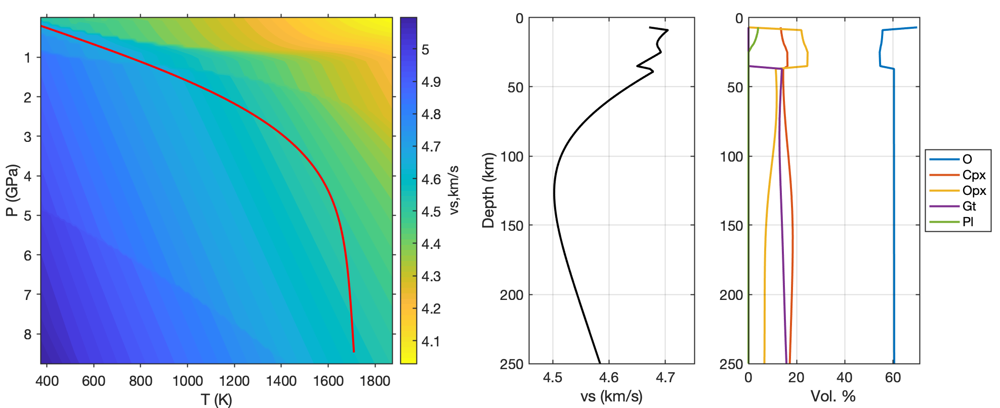

# Simple_X: A MATLAB wrapper for Purple_X
#### A simplified MATLAB wrapper around the [Perple_X](http://www.perplex.ethz.ch/) mineral physics software package for calculating phase equilibria and physical properties in the Earth.

This wrapper is extremely limited in its capabilities and was built for the specific purpose of calculating seismic velocities (Vp & Vs) and density along given pressure-temperature paths. Simply input bulk composition, desired phases (and undesired endmembers, if any), and a temperature and pressure range over which to calculate the phase diagram. A P-T path is calculated assuming half-space cooling and used to extract physical properties from 2-D grid of (P,T,Z) values.

Although Perple_X includes thermodynamic parameters and solutions from many different studies, this wrapper has only been tested using the data from [Stixrude and Lithgow-bertelloni (2011)](https://onlinelibrary.wiley.com/doi/10.1111/j.1365-246X.2010.04890.x) ([stx11ver.dat](./data_files/stx11ver.dat)). The MATALB scripts are meant to be executed in alphanumeric order.

#### Version info
The codes were tested using Mac-OS-X 10.12.2

Data files: [Perple_X_6.8.7_data_files.zip](./_archive/Perple_X_6.8.7_data_files.zip)

Executables: [Perple_X_6.8.7_OSX_O1_optimization_Intel64_core2duo_JS_Oct_22_2019.zip](./_archive/Perple_X_6.8.7_OSX_O1_optimization_Intel64_core2duo_JS_Oct_22_2019.zip)
